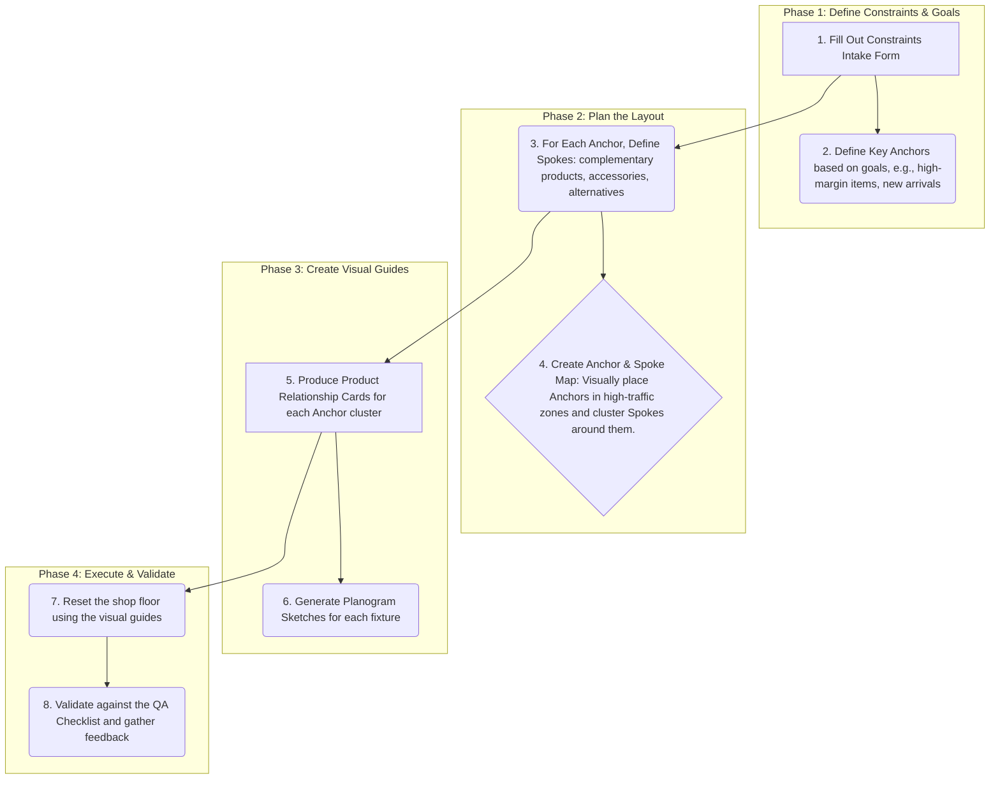

# Shop Reset Methodology: Decision Record

This document records the final decision for the selected shop reset methodology, based on the scoring and evaluation process.

## Selected Methodology: Anchor-and-Spokes

The **Anchor-and-Spokes** methodology has been selected as the optimal approach for the Shop Reset Toolbox. This decision is based on its high scores in key visual and practical criteria, making it a robust and flexible framework for various retail environments.

## Final Scoring Summary

| Methodology | Safety | Visibility | Lighting | Journey | Visual Leg. | Layout Fid. | Reusability | Time | Cognitive | **Weighted Score** |
|---|---|---|---|---|---|---|---|---|---|---|
| Journey-First | 3 | 4 | 3 | 5 | 4 | 4 | 4 | 3 | 3 | **3.75** |
| Category-First | 4 | 3 | 2 | 3 | 5 | 5 | 5 | 4 | 4 | **3.85** |
| Demand/Velocity-First | 3 | 3 | 4 | 3 | 3 | 3 | 3 | 5 | 4 | **3.30** |
| Theme/Story-First | 2 | 4 | 3 | 4 | 3 | 3 | 2 | 2 | 2 | **3.05** |
| **Anchor-and-Spokes** | **4** | **5** | **4** | **4** | **5** | **4** | **4** | **4** | **4** | **4.25** |

## Justification for Selection

The **Anchor-and-Spokes** methodology is the clear winner with a weighted score of **4.25 out of 5.0**. Its strengths align perfectly with the goals of a visual-first, reusable, and constraint-aware toolbox:

*   **Superior Visual and Spatial Logic:** It excels in **Visibility Accommodation** (5/5) and **Visual Legibility** (5/5). The core concept of prominent anchors and related spokes provides an intuitive and scannable structure for both customers and staff.
*   **Balanced Performance:** Unlike other methods that excel in one area but falter in others, Anchor-and-Spokes provides a consistently strong performance across all criteria, including safety, journey coherence, and reusability.
*   **Inherent Flexibility:** The model is naturally parameterized. Anchors and their corresponding spokes can be easily defined, swapped, and reconfigured based on inventory, seasonality, or strategic goals, without requiring a complete overhaul of the entire store layout.
*   **Action-Oriented Artifacts:** The minimal artifacts for this method (Anchor & Spoke Map, Product Relationship Cards) are highly visual, portable, and directly actionable, reducing cognitive load and execution time.

## Trade-Offs Considered

While **Category-First** scored competitively, it is less effective at creating a compelling customer journey and adapting to thematic storytelling. **Journey-First** is strong on experience but weaker on accommodating physical and safety constraints in a systematic way. **Demand/Velocity-First** is highly efficient but can lead to a less intuitive or inspiring shopping experience. **Theme/Story-First** is powerful for engagement but is the least reusable and most complex to execute. The Anchor-and-Spokes method effectively balances the strengths of these other approaches into a single, cohesive framework.

## Summary Storyboard: The Anchor-and-Spokes Method in Action

This storyboard provides a high-level visual overview of the selected methodology from planning to execution.

**Caption:** This storyboard illustrates the four key phases of the Anchor-and-Spokes reset process. It begins with defining constraints and identifying key anchor products. The process then moves to planning the spatial layout by mapping anchors and their corresponding spokes. In the third phase, detailed visual guides are created for staff. The final phase involves executing the reset on the shop floor and validating the result against the initial constraints and goals. This structured, visual-first process ensures a repeatable and efficient reset every time.
