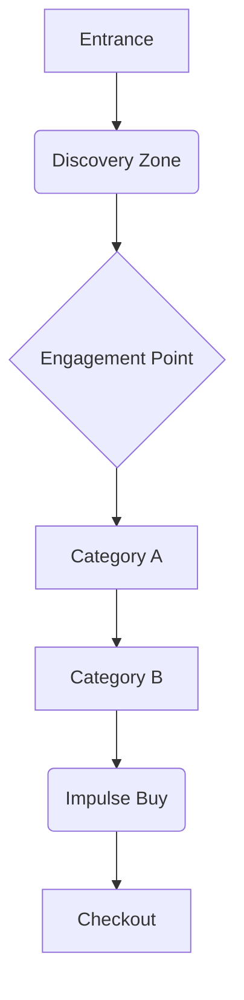
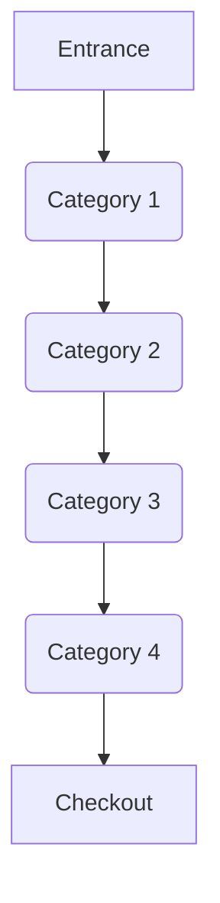
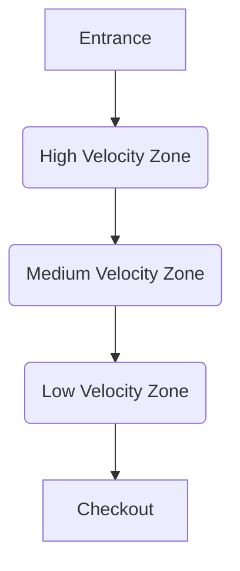
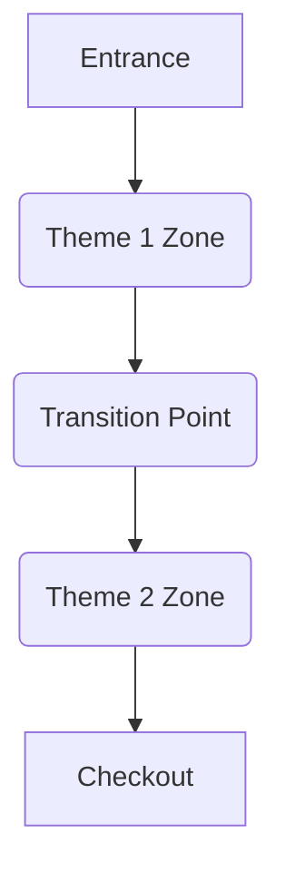
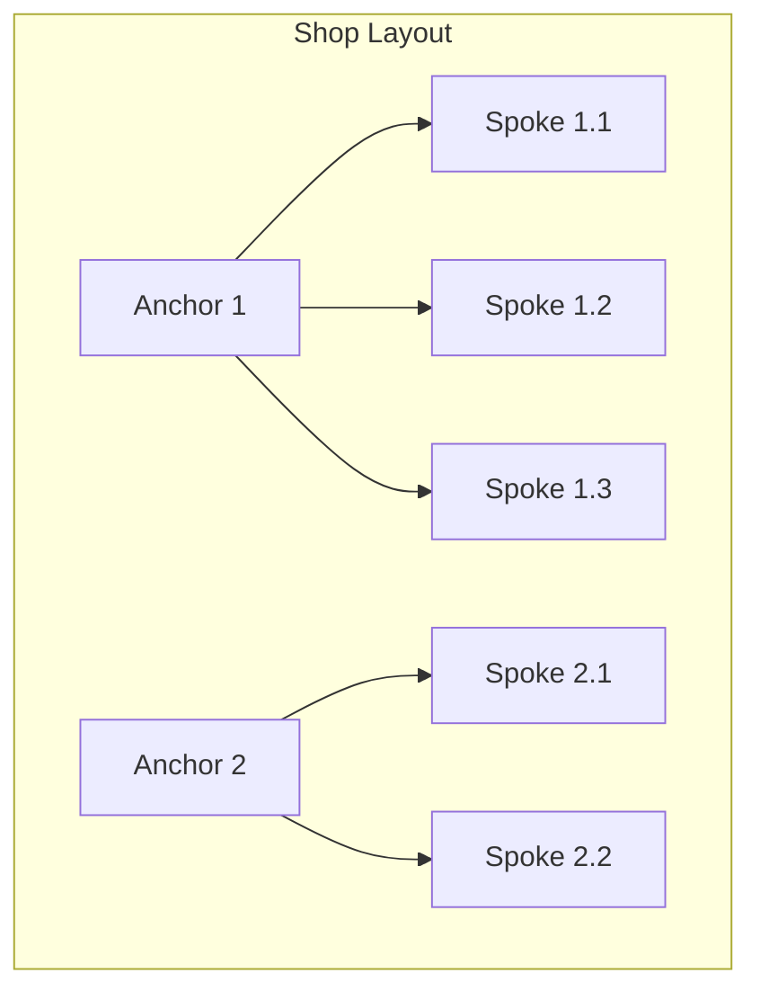

# Shop Reset Methodologies Exploration

This document explores various methodologies for shop resets, focusing on their core principles, visual representations of space and flow, and minimal artifact sets required for repeated execution.

## 1. Journey-First Methodology

**Core Principles:** This method prioritizes the customer's path through the store, designing the layout to guide them through a curated experience. It focuses on storytelling, discovery, and optimizing touchpoints along the customer journey.

**Visual Representation (Low-fi):**



**Minimal Artifact Set:**

*   **Customer Journey Map (Visual):** A visual flow diagram illustrating customer movement, key interaction points, and emotional states. 
    *Caption: This map visually traces the customer's path, highlighting areas for product placement and engagement.* 
    ```mermaid
graph LR
    Start(Customer Enters) --> A(Browse)
    A --> B{Discover Product}
    B -- Emotional High --> C(Engage)
    C --> D(Consider Purchase)
    D -- Decision Point --> E(Checkout)
    E --> End(Customer Exits)
```

*   **Zone Storyboard (Visual):** A series of sketches or images depicting the visual narrative and product presentation within each zone of the customer journey. 
    *Caption: Storyboards visualize the thematic presentation and product arrangement within specific customer journey zones.* 
    ```
+------------------+
|  Discovery Zone  |
|  (Visual Theme)  |
|  [Product A]     |
|  [Product B]     |
+------------------+
        |
        V
+------------------+
| Engagement Point |
|  (Interactive)   |
|  [Product C]     |
|  [Product D]     |
+------------------+
```

## 2. Category-First Methodology

**Core Principles:** This method organizes the shop based on product categories, ensuring logical grouping and easy navigation for customers seeking specific types of items. It emphasizes clear signage, product adjacencies, and efficient inventory management within categories.

**Visual Representation (Low-fi):**



**Minimal Artifact Set:**

*   **Category Block Diagram (Visual):** A block diagram showing the spatial allocation and adjacency of different product categories within the store. 
    *Caption: This diagram illustrates the logical grouping and physical placement of product categories.* 
    ```
+-----------+ +-----------+
| Category A| | Category B|
| (Apparel) | | (Footwear)|
+-----------+ +-----------+
      |             |
      V             V
+-----------+ +-----------+
| Category C| | Category D|
| (Accs.)   | | (Outerwear)|
+-----------+ +-----------+
```

*   **Planogram Sketch (Visual):** A basic sketch or diagram detailing the arrangement of products within a specific fixture or section of a category. 
    *Caption: A planogram sketch provides a visual guide for product placement on shelves or displays within a category.* 
    ```
+-------------------+
| Shelf 1: Product X|
| Shelf 2: Product Y|
| Shelf 3: Product Z|
+-------------------+
```

## 3. Demand/Velocity-First Methodology

**Core Principles:** This method prioritizes product placement based on sales velocity and customer demand. High-demand items are placed in prominent, easily accessible locations to maximize sales and efficiency. It often involves data analysis to identify top-performing products.

**Visual Representation (Low-fi):**



**Minimal Artifact Set:**

*   **Heat Map (Visual):** A visual representation of the store layout with areas colored according to product sales velocity or customer traffic. 
    *Caption: A heat map visually identifies high-traffic and high-sales areas for optimal product placement.* 
    ```
+-------------------+
|  RED (High Sales) |
|  YELLOW (Medium)  |
|  GREEN (Low Sales)|
+-------------------+
```

*   **Product Velocity Matrix (Visual):** A simple matrix categorizing products by their sales velocity and margin, guiding placement decisions. 
    *Caption: This matrix helps prioritize product placement based on sales performance and profitability.* 
    ```
| Product | Velocity | Margin |
|---------|----------|--------|
| Item A  | High     | High   |
| Item B  | Medium   | Medium |
| Item C  | Low      | High   |
```

## 4. Theme/Story-First Methodology

**Core Principles:** This method creates immersive shopping experiences by organizing products around compelling themes or narratives. It focuses on evoking emotions, inspiring customers, and encouraging cross-category purchases related to the theme.

**Visual Representation (Low-fi):**



**Minimal Artifact Set:**

*   **Theme Concept Board (Visual):** A collage of images, colors, textures, and keywords that define the aesthetic and emotional tone of a specific theme zone. 
    *Caption: A concept board visually communicates the overarching theme and atmosphere for a shop section.* 
    ```
+-------------------+
|  Theme: [Seasonal]|
|  Colors: [Palette]|
|  Imagery: [Mood]  |
+-------------------+
```

*   **Story Flow Diagram (Visual):** A diagram illustrating the narrative progression and product integration within a themed area, showing how different products contribute to the story. 
    *Caption: This diagram outlines the narrative flow and product integration within a themed display.* 
    ```
graph TD
    Start(Theme Intro) --> A(Product Group 1)
    A --> B(Product Group 2)
    B --> C(Climax Product)
    C --> End(Call to Action)
```

## 5. Anchor-and-Spokes Methodology

**Core Principles:** This method positions key 

**anchor** products or displays as focal points and arranges related or complementary items ( **spokes**) around them. This creates natural points of interest and encourages exploration of related products.

**Visual Representation (Low-fi):**



**Minimal Artifact Set:**

*   **Anchor & Spoke Map (Visual):** A spatial diagram identifying anchor products/displays and the corresponding spoke products that surround them. 
    *Caption: This map visually organizes the store around key anchor points and their related product spokes, guiding layout and customer flow.* 
    ```
    +-------------+
    |   Anchor A  |
    | (Focal Pt)  |
    +-------------+
      /   |   \
     /    |    \
+-------+ +-------+ +-------+
|Spoke 1| |Spoke 2| |Spoke 3|
+-------+ +-------+ +-------+
    ```

*   **Product Relationship Card (Visual):** A simple card defining the relationship between an anchor product and its spokes, ensuring a cohesive merchandising story. 
    *Caption: These cards define the merchandising logic, explaining why specific spoke products are placed with a particular anchor.* 
    ```
+------------------------------------+
| ANCHOR: [Product Name/Display]     |
|------------------------------------|
| SPOKE 1: [Product] - Complements...|
| SPOKE 2: [Product] - Accessorizes..|
| SPOKE 3: [Product] - Alternative...|
+------------------------------------+
```

