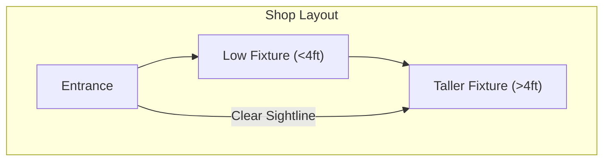
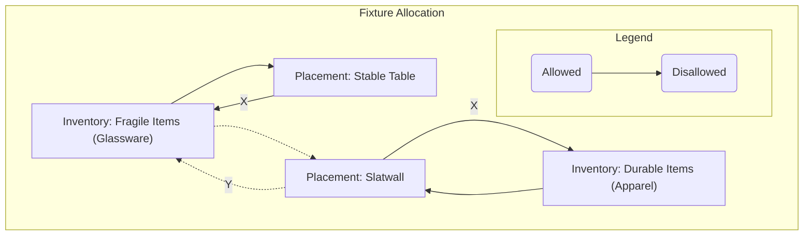
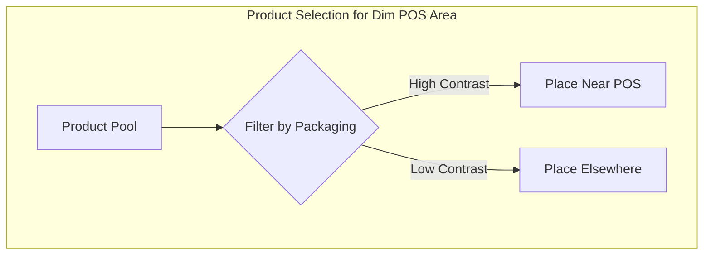

# Constraints Intake Form

This document is a template for you to provide the specific constraints, layout details, and priorities for your shop. Filling this out is the first step in generating a custom reset plan. Please fill in the `<PLACEHOLDER>` values in the YAML section below.

## Machine-Readable Configuration (`constraints.yaml`)

---
# Copy and paste the text below into a new file named `constraints.yaml` and edit it.

# 1. Shop Layout & Sections
# Describe your shop's physical layout and define its key sections.
shop_layout:
  description: <PLACEHOLDER: A brief text description of the overall store layout, e.g., "A long, rectangular space with the entrance on the short wall. Windows on the left, POS at the back right.">
  sections:
    - name: "Entrance Zone"
      description: <PLACEHOLDER: "The first 10 feet from the door. High traffic.">
      fixtures: ["table", "mannequin"]
    - name: "Main Floor"
      description: <PLACEHOLDER: "The central area of the shop.">
      fixtures: ["gondola", "4-way rack"]
    - name: "Back Wall"
      description: <PLACEHOLDER: "The wall at the very back of the store.">
      fixtures: ["slatwall", "shelving"]
    - name: "POS Area"
      description: <PLACEHOLDER: "The area immediately surrounding the checkout counter.">
      fixtures: ["counter", "small display case"]

# 2. Constraints
# Define the specific rules and conditions for your space.
constraints:
  visibility:
    - zone: "Entrance Zone"
      rule: "no_higher_than_4ft"
      description: <PLACEHOLDER: "Keep sightlines clear from the entrance.">
    - zone: "Window Display"
      rule: "visibility_only"
      description: <PLACEHOLDER: "Products in the front window are for display only, not for customers to touch.">

  safety:
    - fixture_type: "slatwall"
      rule: "no_fragile_items"
      description: <PLACEHOLDER: "Slatwall hooks can be unstable; avoid placing glass or ceramic items here.">
    - zone: "all"
      rule: "clear_egress_path_3ft"
      description: <PLACEHOLDER: "Maintain a minimum 3-foot wide path to all emergency exits.">

  lighting:
    - zone: "POS Area"
      condition: "dim"
      tactic: "high_contrast_packaging"
      description: <PLACEHOLDER: "The lighting near the checkout is poor. Use products with bright, bold packaging to improve visibility.">

# 3. Inventory Taxonomy (Optional)
# Define your product categories and attributes to help filter and select items.
inventory_taxonomy:
  categories:
    - "Apparel"
    - "Accessories"
    - "Home Goods"
    - "Footwear"
  attributes:
    - name: "is_fragile"
      type: "boolean"
    - name: "is_new_arrival"
      type: "boolean"

# 4. Priorities & Success Metrics (Optional)
# Override the default weights for the methodology scoring rubric. Weights must sum to 1.0.
custom_scoring_weights:
  safety_accommodation: 0.20
  visibility_accommodation: 0.15
  journey_coherence: 0.20
  visual_legibility: 0.15
  reusability: 0.10
  # --- (and so on for other criteria)

---

## Visual Examples of How Constraints Are Applied

These mini-diagrams illustrate how the constraints you define above translate into concrete layout decisions.

### Example 1: Visibility Constraint

**Constraint:** `rule: "no_higher_than_4ft"` in the `Entrance Zone`.

**Layout Decision:** Low-profile fixtures are placed in the front of the store to maintain clear sightlines to the back.

**Caption:** This diagram shows how a height constraint in the entrance zone ensures customers can see deeper into the store, drawing them in.

### Example 2: Safety Constraint

**Constraint:** `rule: "no_fragile_items"` on `fixture_type: "slatwall"`.

**Layout Decision:** Fragile items are explicitly placed on stable tables or shelves, while only durable goods are placed on the slatwall.

**Caption:** This shows the direct mapping from a product's safety attribute (`is_fragile`) to its allowed placement on specific fixture types.

### Example 3: Lighting Constraint

**Constraint:** `tactic: "high_contrast_packaging"` in the `POS Area` where `condition: "dim"`.

**Layout Decision:** Products selected for the checkout area are filtered to include only those with bold, high-contrast packaging.

**Caption:** This illustrates how a lighting constraint acts as a filter for product selection, ensuring items placed in dimly lit areas are still visually prominent.
