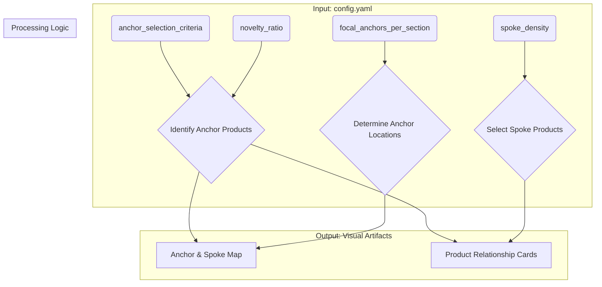

_# Parameterization Model: Tuning the Anchor-and-Spokes Reset

This document defines the adjustable **"knobs"** that allow users to customize the Anchor-and-Spokes methodology. These parameters are set in a simple configuration file and directly influence the generation of the core visual artifacts.

## Configuration Knobs

These knobs provide high-level control over the reset strategy without requiring manual edits to the visual artifacts. They are designed to be human-readable and easy to modify.

| Knob | Description | Example Value(s) |
|---|---|---|
| `focal_anchors_per_section` | The number of primary "Anchor" displays or products to establish in each defined shop section. | `2` |
| `anchor_selection_criteria` | The business rule used to identify which products become Anchors. | `high_margin`, `new_arrival`, `high_velocity`, `seasonal_theme` |
| `spoke_density` | The number of complementary "Spoke" products to associate with each Anchor. | `3` |
| `novelty_ratio` | The target mix of new vs. existing products within a reset. A value of `0.2` means 20% new products. | `0.2` |
| `pos_contrast_tactic` | The strategy for product selection near a dim Point of Sale (POS) to ensure visibility. | `high_contrast_packaging`, `bold_color_blocking` |
| `section_weights` | A mapping of shop sections to a priority score, influencing traffic flow and anchor placement. | `{"front_window": 1.5, "back_wall": 0.8}` |

## Sample Configuration File (`config.yaml`)

This is a human-editable file where users set the values for the knobs.

```yaml
# --- Shop Reset Configuration ---
# Adjust these "knobs" to tune the reset plan.

# The business rule for selecting Anchor products.
# Options: high_margin, new_arrival, high_velocity, seasonal_theme
anchor_selection_criteria: new_arrival

# The number of major Anchor points to create in each section.
focal_anchors_per_section: 2

# The number of complementary "Spoke" products to place around each Anchor.
spoke_density: 4

# The target ratio of new products to feature (0.0 to 1.0).
novelty_ratio: 0.3

# The visual strategy for products near the Point of Sale (POS).
# Options: high_contrast_packaging, bold_color_blocking, illuminated_display
pos_contrast_tactic: bold_color_blocking

# Relative importance of different shop sections (higher number = more priority).
section_weights:
  entrance_zone: 1.5
  main_floor: 1.0
  clearance_section: 0.7
  pos_area: 1.2
```

## Parameter-to-Artifact Mapping

This diagram illustrates how the configuration knobs directly influence the creation of the primary visual artifacts.



**Caption:** The `config.yaml` file provides the inputs for the reset process. The `anchor_selection_criteria` and `novelty_ratio` are used to **Identify Anchor Products** from the inventory. The `focal_anchors_per_section` and `section_weights` **Determine Anchor Locations** on the shop map. The `spoke_density` is used to **Select Spoke Products** for each anchor. This logic then generates the two core visual artifacts: the **Anchor & Spoke Map** and the **Product Relationship Cards**. This ensures that any change to a knob automatically propagates to the final visual guides.
