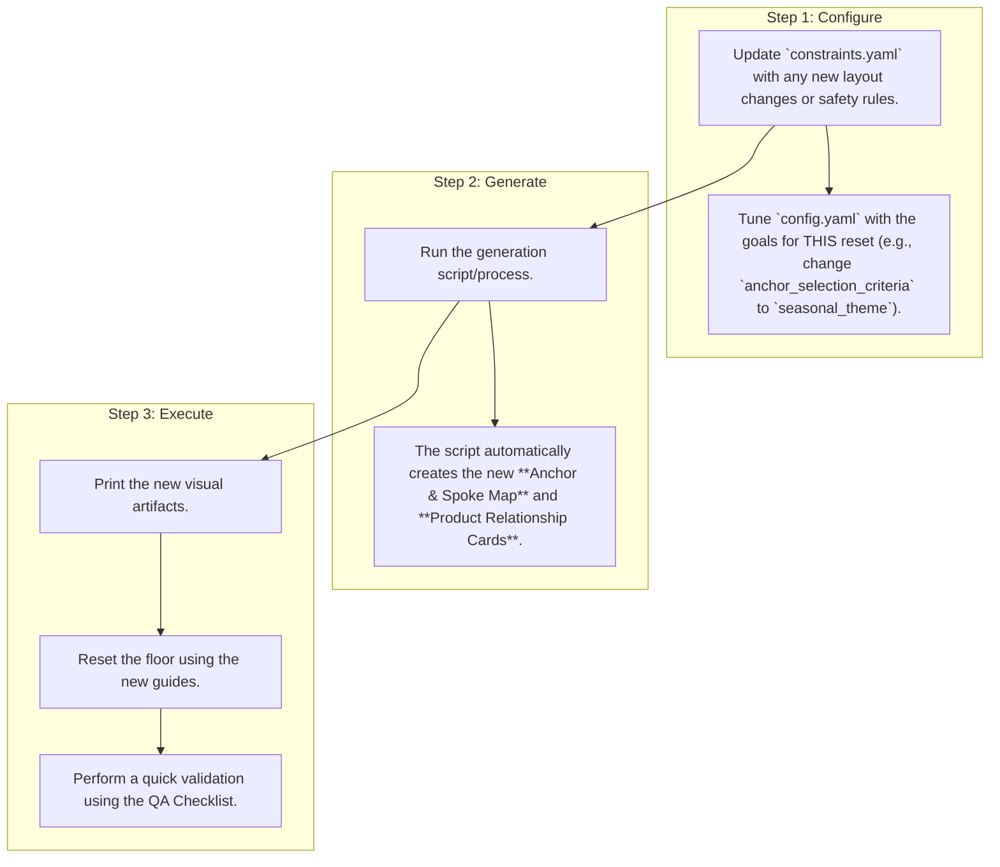

# Re-Run Guide: Your One-Page Quick Start

This guide provides a streamlined, visual process for conducting fast and reliable shop resets using the established toolbox.

## The 3-Step Re-Run Process

**Caption:** The re-run process is simplified into three core steps. **Configure:** Update the two YAML files with any new information or goals. **Generate:** Automatically create the new visual guides. **Execute:** Print the guides and reset the floor.

---

## Text Appendix: Detailed Steps

**Step 1: Configure (5-10 minutes)**

1.  **Open `constraints.yaml`:**
    *   Has the physical layout of the store changed? Add or remove sections/fixtures.
    *   Are there any new safety or visibility rules? Add them to the `constraints` section.
2.  **Open `config.yaml`:**
    *   What is the primary goal of this reset? To push new arrivals? To focus on high-margin items? Change the `anchor_selection_criteria` knob accordingly.
    *   Do you want more or fewer focal points? Adjust the `focal_anchors_per_section`.
    *   Do you need to change the product density? Adjust `spoke_density`.

**Step 2: Generate (1 minute)**

1.  **Execute the generation command:**
    *   `<PLACEHOLDER: Instructions on how to run the generation script, e.g., 
    run 
on your local machine.>`
2.  **Check the output folder:**
    *   A new folder named `<PLACEHOLDER: e.g., Reset_YYYY-MM-DD>` will be created.
    *   Inside, you will find the updated PDF and PNG versions of the `Anchor_&_Spoke_Map.pdf` and `Product_Relationship_Cards.pdf`.

**Step 3: Execute (Time varies)**

1.  **Print the Artifacts:**
    *   Print the **Anchor & Spoke Map** on A4/Letter paper.
    *   Print the **Product Relationship Cards** on 4x6" card stock.
2.  **Distribute to Staff:** Give each team member the relevant cards for the section they are working on.
3.  **Reset the Floor:** Use the map and cards as the definitive guide for moving fixtures and placing products.
4.  **Final Walkthrough:** Once complete, use the **Validation Loop QA Checklist** to do a quick final check of the space.

This process is designed to be fast, repeatable, and require minimal training, ensuring consistent and high-quality resets every time.
